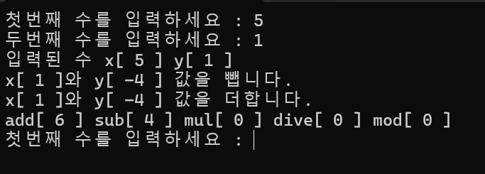
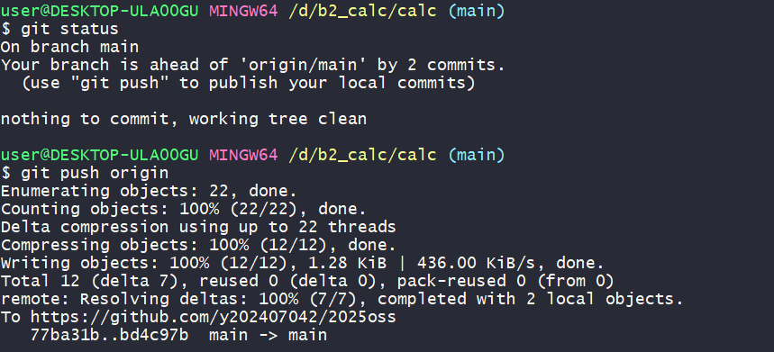
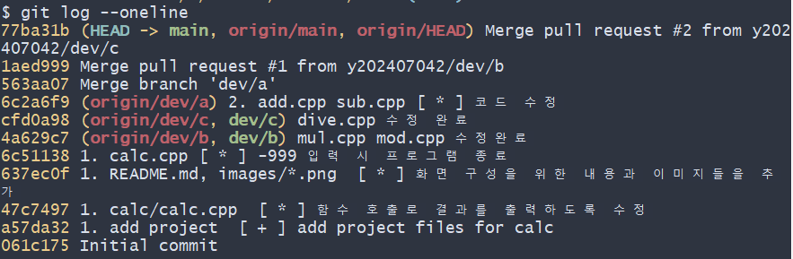
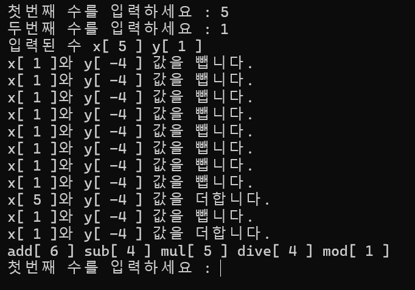

# calc

## oss 기말 프로젝트

저장소 : https://github.com/y202407042/2025oss

| 팀원(역할) | 업무 |
|------------|------|
| 김민서(팀장 - 202407042) | dev/a, 병합 및 main 브랜치 병합 |
| 최아라(팀원 - 202407052) | dev/b, dev/c 브랜치 작업 및 README.md 작성 |

## 문제해결 방법과 순서

1. main 브랜치와 dev/a 브랜치 병합
2. pull request 사용으로 인해 충돌이 발생하지 않음
3. 충돌이 회피된 것으로 인해 vs에서 파일을 다시 열음
4. 충돌 파일을 수작업으로 찾아냄
5. 수정 후 프로그램 정상 실행 확인
6. README.md 수정 및 push

## 중간과정 스크린샷

1. dev/b, dev/c 브랜치에서 각각 mul.cpp, mod.cpp, dive.cpp 수정 및 커밋

2. 팀장이 병합 도중 mul.h와 dive.h에서 충돌 발생

3. 충돌 해결 후 git merge 완료

## 병합 완료 후 상태 화면

- `git log --oneline` 결과:

## git flow : 결과 화면

## 프로그램 실행 결과 화면

- 예시: 입력 5, 1  → add/sub/mul/div/mod 값 출력

